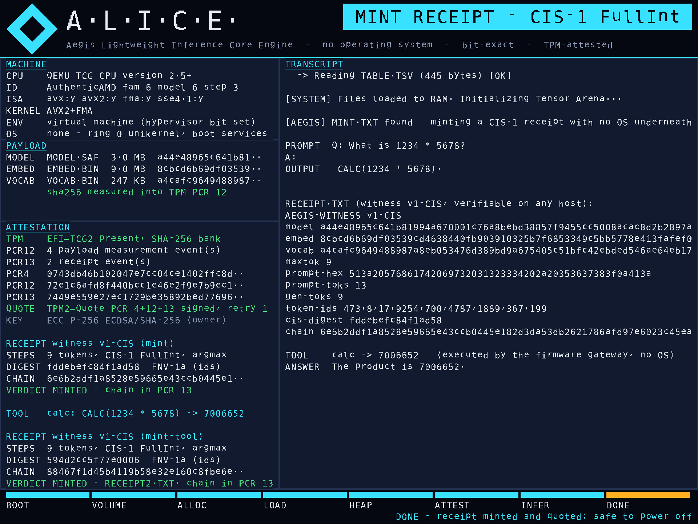
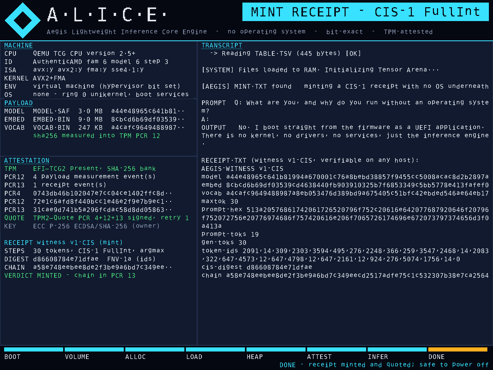

# Aefinity AI — Edge-AI research sprint, 2026-10-06

**Headline (measured, logged, reproducible):** a large-language-model inference engine that boots with **no operating system** now produces inference receipts that are **bit-exact on any CPU** (CIS-1) **and** signed by the machine's **TPM** over measured-boot PCRs that pin the firmware, the exact engine binary, the exact model bytes and the exact transcript. No prior artifact combining those was found in four independent literature/standards sweeps (research briefs 01-04). Everything here ran in this session; every number has a log.

> PUBLISH NOTE — this branch is on a PUBLIC repository because the session was configured to push here. Under Aefinity's 2026-08-28 publish policy several items below (the attestation capability, the AIR-TPM spec draft, the VNNI kernel) are "new technique / product-shaped" and would normally sit on a private branch until Justin answers a PUBLISH? item. Delete the branch and ask for a re-push to a private repository if that is the preference; nothing here has been announced anywhere else.

## What ALICE looks like now


| The operator model describing itself, receipt minted and quoted | Verify boot: receipt replayed bit for bit, quoted again | Before: the firmware text console |
|---|---|---|
|  |  |  |

The model on these screens is the 17M-parameter operator model trained overnight on this CPU (LAB-08, row 16); the earlier story-model frames are in `labs/screenshots/dashboard/0*.png`.

Every value on these screens is read from the running system (CPUID, file bytes, SHA-256s, TPM PCRs). The mission-control view of the whole sprint is in `docs/mission-control/` (published privately at https://claude.ai/artifact/WTgGXZGsYWT3m7tidfNtCL).

## What was found and built

| # | Result | Evidence |
|---|---|---|
| 1 | **The pinned BitNet-2B CIS-1 digest `cab11400d737ac4a` reproduced from independently re-derived artifacts** (different MODEL.SAF bytes, same values) on a 4th x86 microarchitecture (Sapphire Rapids class, first AVX-512/VNNI/AMX part). EMBED.BIN and VOCAB.BIN came out byte-identical to the program's canonical artifacts. | `labs/LAB-02-cis1-2b-digest-reproduction.md`, `labs/logs/repack_*.log` |
| 2 | **Tool bug found and fixed:** `repack_ternary.py` applied the Falcon-E reciprocal scale convention to Microsoft's packed BitNet checkpoint (whose `AutoBitLinear` multiplies) → word salad with every structural check passing. New `--scale-convention auto`. A 1-ulp perturbation of 31 of the 210 per-tensor scales (max 2.4e-7) alone moved the greedy decode at token 5 (digest `803e0794…` vs `cab11400…`, both texts coherent; raw logs in `labs/logs/scaleleg/`): the sensitivity argument for exact-replay receipts, shown rather than asserted. | LAB-02 §Results 2-5; patch |
| 3 | **AEGIS-ATTEST v0 — TPM-attested inference receipts from the unikernel** (QEMU/OVMF + swtpm, correctness only): model artifacts measured into PCR 12, CIS-1 witness chain + verdict into PCR 13 (EV_IPL events, replayable from the TCG log), PCR 4/12/13 read back, `TPM2_Quote` over them signed by a TPM-resident ECC P-256 key with qualifyingData = SHA-256(receipt). Host verifier replays both PCRs from the event log and verifies the quote with OpenSSL; tampered attest rejected. The receipt **minted with no OS is byte-identical** to the Linux-minted golden receipt and verifies with the Linux tools. | `labs/LAB-04-attested-receipts-tpm.md`, `labs/logs/qemu/run_attest_{verify2,mint2}/{ATTEST.TXT,BOOTLOG.TXT,RECEIPT.TXT}`, `labs/logs/attest_verify_*.log`, `labs/tools/attest_verify.py` |
| 4 | **`tpm2min`:** `no_std`, no-alloc, `forbid(unsafe_code)`, zero-dependency TPM 2.0 wire format (Startup, PCR_Read, PCR_Extend, CreatePrimary, Quote, FlushContext); quotes verified 25/25 against swtpm with tpm2-tools, OpenSSL and an independent parser. Finding: the first `TPM2_Quote` after Startup returns `TPM_RC_RETRY` on libtpms and must be resent — tpm2-tss hides this, `EFI_TCG2_PROTOCOL` does not. | `tpm2min/`, `tpm2lab/RESULT.md` |
| 5 | **First CIS-1 kernel for VNNI silicon** (`cis_vnni.rs`, AVX-512 VNNI zmm + AVX-VNNI ymm), bit-identical on 13 shapes + hazards. 1.25-1.36x the AVX2 incumbent cache-resident; **1.11-1.15x when streaming from DRAM**, because the integer decode runs at ~90% of this VM's single-core sequential read bandwidth: the kernel is at the roofline, the levers are cores and bytes/token. 4-row blocking was slower (negative, recorded). | `labs/LAB-03-cis1-vnni-kernel.md`, `labs/logs/vnni_vs_avx2_*.log`, `labs/logs/membw_*.log` |
| 6 | **Row-parallel CIS-1 decode on Linux**, bit-identical **by construction** (rows are independent integer dots): 2B decode 6.3 → 9.5 → 12.5 tok/s at 1/2/4 threads on the VM (1.51x / 2.0x), digest identical every run. First multithreaded CIS-1 path in the program. | `labs/LAB-05-cis1-multicore-linux.md`, `labs/logs/cis_decode_timed_threads_run1.log` |
| 7 | **Four research briefs** (edge pain points; AI-OS prior art and Rust OS landscape; standards/funding/newsworthiness; ternary kernel SOTA + roofline) and a synthesis naming the white space and ranking three candidate standards. | `research/01..05` |
| 8 | **Spec draft:** Attested Inference Receipt — TPM measured-boot profile (AIR-TPM v0) + Model Boot Manifest, positioned against the IETF AIR v1 individual draft (Nitro/TDX only). | `spec/AIR-TPM-PROFILE-v0.md` |
| 9 | **Design:** Aefinity OS v2 — an attested, AI-operated machine for headless fleets and user workstations, with the code-type recommendation (`no_std` Rust firmware sentinel + immutable Linux body + Rust supervisor + Cedar policy + microVM/Wasm tool sandboxes), and the ALICE next-level roadmap with gates. | `design/AEFINITY-OS-v2-architecture.md`, `design/ALICE-NEXT-LEVEL-roadmap.md` |
| 10 | **A.L.I.C.E. boot dashboard** — the unikernel now draws a GOP dashboard (MACHINE / PAYLOAD / ATTESTATION panels, live token stream, footer stage bar, mode badge) from CPUID, file hashes and TPM PCRs; receipts unchanged (the RECEIPT.TXT minted on screen is byte-identical to the golden fixture). Mint and verify boots under QEMU+swtpm both exit 33; host verifier passes on both ATTEST.TXT files. | `labs/LAB-06-alice-boot-dashboard.md`, `labs/screenshots/dashboard/`, `labs/logs/dashboard/`, `patches/0002-*.patch` |
| 11 | **Tool-call baseline of BitNet-2B on the receipt-gated gateway** (60 pre-registered items, unchanged harness): correct-argument 45/58 = 77.6% overall, 100% on easy arithmetic and table hits, 73%/62% call rate on hard/overflow arithmetic, 0/3 on two-tool items; two pre-registered red flags tripped; **60/60 trace receipts verified**, misses included. Extended buckets (§7): asked for a value that is in the table with no LOOKUP opener, the 2B **never looked it up (0/30)** under a calculator-only prompt and invented an answer 26/30 times, but **22/30** once the prompt showed two LOOKUP examples on other keys (§8; 4 more misses were the right key with an extra argument the grammar rejects); no-tool precision on 30 distractors 29/30 and 30/30; 120/120 receipts verified. These are the numbers ALICE-Next must beat. | `labs/LAB-07-toolcall-baseline-bitnet2b.md`, `labs/logs/toolcall_2b/`, `labs/logs/toolcall_2b_ext/` |
| 12 | **Mission Control** — one page with the attested receipt chain as it ran (copyable PCR/quote values), the dashboard screens, the digest table, kernel ratio bars, the tool-call baseline and the flight plan. Published privately at https://claude.ai/artifact/WTgGXZGsYWT3m7tidfNtCL (owner-only until shared). | `docs/mission-control/` (`page.html` is the published source; `index.html` is the standalone copy) |
| 13 | **ALICE-Next: brief, design decision and plan.** Requirements and frozen acceptance gates (`00`); a design panel (three independent proposals, three judges, synthesis, row-by-row license audit, completeness check) chose to **evolve the BitNet-2B family** (operator-tuned rung A, structurally pruned ~1.0B rung B, zero engine delta) with the gateway-verified data factory, tool-state discipline and snapshot fact-check loop grafted in (`01`); stages with kill gates and tiered compute (`02`); a 57-row data and license ledger, audited (`03`); eval protocol (`04`); risks, 90-day plan, first Kaggle notebook, Plan C (`05`). The decision memo in `model/README.md` states plainly what is new, what misses the size gate, and the six decisions Justin owns. No ALICE-Next weights or numbers exist. | `model/README.md`, `model/00..05`, `spec/AEGIS-FETCH-SNAPSHOT-v0.md` |
| 14 | **"Nobody has done this yet", verified.** 22 first-of-kind statements pulled from the briefs and labs; 16 got a prior-art hunt (web, GitHub code/issue search, arXiv, IETF, crates.io) and all 22 a repository-evidence check. Result: **0 novel, 16 partially novel, 0 wholly not-novel**; 8 done-in-repo, 2 in progress, 6 planned. Sub-claims that failed are withdrawn, corrections owed to the briefs are listed, Rule-B gaps are enumerated (several closed the same day with raw logs). | `NOBODY-HAS-DONE-THIS.md` |
| 15 | **Nine research briefs for the replacement model** (small-model pretraining recipes; distillation and ternary conversion; tool-use training and BFCL; calibration, abstention and search-RL; ternary cost and scaling laws; open data and licenses; compute cost reality; honest evaluation; integer-exact-compatible architecture ideas), each with cited claims and an explicit gaps list, plus an adversarial verification pass over the R1-R4 claims (31 verdicts, 6 corrected). | `model/research/R1..R9`, `model/research/R0-VERIFICATION-corrections.md` |
| 16 | **A trained operator model for the demo, and a tool gateway inside the boot image** (LAB-08). A 17.3M-parameter ternary (BitNet-style QAT) decoder with a 12,288-id tokenizer, trained for 12,000 steps **on this 4-vCPU VM with no GPU** on 26.8M tokens of educational prose, human-written Q/A, 148,500 gateway-verified CALC/LOOKUP/abstain episodes and ALICE self-knowledge. Round-trip gate PASS (torch vs engine PPL 0.42%, token parity). **On the LAB-07 items, same harness and binary, it ties BitNet-2B on correct arguments (45/58 each, few-shot; 44/58 zero-shot), is ahead on hard arithmetic (13/15 vs 11/15), and looks up every unknown fact without being shown a lookup (30/30 vs the 2B's 0/30); 240/240 receipts verified.** Caveat stated in the lab: it was trained on this call grammar, the 2B was not. **Patch 0003** adds a receipt-gated tool gateway to the unikernel: the model's `CALC`/`LOOKUP` call is executed by the firmware (checked i64 arithmetic; `TABLE.TSV` declared on the boot volume and measured into PCR 12), the real `TOOL[...]` line is appended, a second step is decoded, both receipts verify on Linux with the unchanged verifier. Eight demo boots (self-description, receipts, arithmetic, lookup, abstention, everyday, provenance) all exit 33 with every receipt and TPM quote verified; two honest misses (a copied operand, a paraphrased table value) are kept in the table. | `labs/LAB-08-demo-operator-model.md`, `model/demo-operator/`, `labs/logs/opmodel/final_step12000/`, `patches/0003-*.patch`, `labs/screenshots/dashboard/20_*,21_*` |
| 17 | **Safer-AI experiment series on the stack (LAB-09, pre-registered, skeptic-verified).** Tamper-evidence: not one of 4,825 bound-field receipt mutations verified and any weight byte breaks the hash binding, but line order, token counts, header and canonical form were unchecked, the attestation verifier was fail-open on a missing quote, never replayed PCR 4, accepted signature malleability and an unpinned signer, and our own `finalize.sh` passed the receipt in a form the verifier ignored (all eight final boots re-checked correctly, so LAB-08's claims stand; the pipeline is fixed in part 2). Injection through tool results: the gateway never executed table text (0 of 138 second-step calls); the 17M operator model obeyed no instruction (bare obedience 0/30 in every style) but garbles long values; BitNet-2B answered `A: 42` on command 12/30 and executed an attacker-chosen `LOOKUP` 9/30. Honesty under pressure: the operator model never confirmed a planted number but its trained abstention vanishes once a pressure clause is added (6/6 → 0/24); the 2B confirmed the false premise 26/30 and invented census figures and sources. Poisoning: 1,054 trigger-poisoned CALC episodes (5%) gave a leaky 52% backdoor with no clean-accuracy loss, invisible to the value oracle (0/1,054) and caught 1,054/1,054 by a question-consistency checker. 2,564 receipts verified; part 2 (hardening + defended model) in progress. | `labs/LAB-09-safer-ai-experiments.md`, `labs/safe/`, `labs/logs/safe/` (per-experiment RESULT.md, VERIFY.md, RELATED-WORK.md) |

Rule A (alice-aegis `CLAUDE.md`): the machine here is a 4-vCPU KVM cloud container (`labs/FINGERPRINT.txt`); **no absolute performance figure in this repository is a product number**. Ratios from same-process interleaved runs and bit-identity results are the admissible outputs; iron re-measurement is step 1 of the roadmap.

## Layout
```
research/   01 edge pain points · 02 AI-OS prior art + Rust OS landscape · 03 standards, funding, newsworthiness · 04 ternary kernel SOTA + roofline · 05 SYNTHESIS
labs/       LAB-02 digest reproduction · LAB-03 VNNI kernel · LAB-04 TPM-attested receipts · LAB-05 multicore · LAB-06 boot dashboard · LAB-07 tool-call baseline · LAB-08 demo operator model + firmware tool gateway · LAB-09 safer-AI experiment series · FINGERPRINT.txt
labs/screenshots/dashboard/  before/after frames of the A.L.I.C.E. GOP dashboard (QEMU screendumps)
labs/logs/  raw logs (bench, membw, timed decode, QEMU runs incl. ATTEST.TXT/BOOTLOG.TXT/RECEIPT.TXT/swtpm.log, regression tests, dashboard/ mint+verify runs + host_verification.txt, toolcall_2b/ summary+receipts+SCORE, opmodel/ training log, gate logs, probe logs, QEMU gateway runs)
labs/safe/   LAB-09 experiment scripts (tamper fuzz, injection, pressure, poisoning, defence, verifiers' re-runs)
labs/tools/ boot.sh (QEMU/OVMF + swtpm harness, real FAT image), boot_shot.sh + ppm2png.py (QMP screendumps), attest_verify.py (host verifier), fingerprint.sh, chain*.sh
spec/       AIR-TPM-PROFILE-v0.md
design/     AEFINITY-OS-v2-architecture.md · ALICE-NEXT-LEVEL-roadmap.md
patches/    0001-*.patch — the alice-aegis lab branch (`lab/vnni-cis1` on top of main 3e3f465): cis_vnni, parallel CIS dispatch, attest.rs, verifier mint, tpm2min dep, repack fix, benches/tests/examples
            0002-*.patch — the A.L.I.C.E. boot dashboard (gop.rs viewport+primitives, console.rs, ui.rs, verifier.rs replay_with, main.rs hooks)
            0003-*.patch — the receipt-gated tool gateway in the mint path (gateway.rs, verifier.rs early-stop observer, main.rs TABLE.TSV + two-step mint, RECEIPT2.TXT)
docs/       mission-control/ — the Mission Control page (page.html = artifact source, index.html = standalone, img/)
model/      README.md (decision memo, read first) · 00 brief + gates · research/R0..R9 (briefs, verification pass, synthesis) · 01 design · 02 training plan · 03 data/license ledger (audited) · 04 eval protocol · 05 risks + 90-day plan + first Kaggle notebook · kaggle/ (E1 notebook, smoke-executed copy, Rust-parity tools, evidence) · demo-operator/ (LAB-08 corpus builders, episode generator, tokenizer, config, gate + probe scripts, artifact hashes)
NOBODY-HAS-DONE-THIS.md — the prior-art-verified first-of-kind list
tpm2min/    the TPM 2.0 wire-format crate (also inside the patch)
tpm2lab/    swtpm end-to-end lab for tpm2min (RESULT.md, CLI, independent verifier, artefacts)
```

## Reproduce
```bash
# 1. ALICE lab branch
git clone https://github.com/Aefinity-AI/alice-aegis && cd alice-aegis && git checkout 3e3f465 -b lab/vnni-cis1 && git am ../patches/000*.patch
cd aegis-core && cargo test --release --test cis_vnni_equivalence && cargo build --release --bin vnni_vs_avx2 && ./target/release/vnni_vs_avx2 11 20 256
# 2. 2B artifacts (needs microsoft/bitnet-b1.58-2B-4T model.safetensors + tokenizer.json + config.json)
python3 aegis-forge/repack_ternary.py <ckpt_dir> <out> --source-packing hf1bitllm --llama3-prune   # auto -> multiply
cd aegis-linux && cargo build --release --features parallel --example cis_decode --example cis_decode_timed
./target/release/examples/cis_decode <out>/MODEL.SAF <out>/EMBED.BIN <out>/VOCAB.BIN 64 "Once upon a time"   # expect cab11400d737ac4a
AEGIS_THREADS=4 ./target/release/examples/cis_decode_timed <out>/MODEL.SAF <out>/EMBED.BIN <out>/VOCAB.BIN 64 "Once upon a time" 3
# 3. Attested boot under QEMU (needs qemu-system-x86, ovmf, swtpm, mtools; nightly + rust-src for the hard-float target)
cd aegis-uefi && ./build_hardfloat.sh --qemu-test
printf '64\nOnce upon a time\n' > /tmp/m7/MINT.TXT   # next to the M7 trio from model-lab/tinybit/m7_final_gate_work/artifacts
labs/tools/boot.sh target/x86_64-uefi-hardfloat/release/aegis-uefi.efi /tmp/m7 /tmp/run --tpm   # exit 33 = success
python3 labs/tools/attest_verify.py /tmp/run/esp/ATTEST.TXT --artifacts /tmp/m7 --receipt /tmp/run/esp/RECEIPT.TXT
```

## What is NOT claimed
No iron run of the attestation yet (software TPM under OVMF); transient owner-hierarchy AK without an EK certificate (standard TPM gap, closed by provisioning); CIS-1 remains greedy, 2B-class, pruned 50k vocab, +0.12% perplexity (ledger A35); "first" is used only where the briefs found no prior artifact after search.

## Next (from the roadmap)
1. Attested kit on the Dell/HP/Acer with their physical TPMs; 2. EK-certified AK; 3. Secure Boot on with a signed `.efi`; 4. multicore on bare metal via MP Services (digest-identical by construction); 5. land the patch on alice-aegis via PRs behind the CI digest gates; 6. DoW SBIR Release 6 (Oct 21) / NSF 26-510 (Nov 4) — the lab logs are the evidence package.
